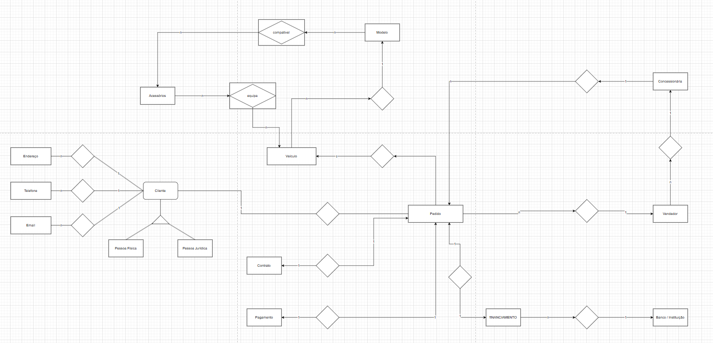

# Toyota Tech


## Banco de dados

### Definição das entidades, atributos e relacionamentos por meio de uma modelagem conceitual completa com diagrama ER.

.
##

### Aplicação da normalização até a Terceira Forma Normal (3FN), com justificativa técnica das escolhas e eliminação de anomalias.

<center>
| Tabela         | 1FN | 2FN | 3FN | Observações |
| -------------- | --- | --- | --- | ----------- |
| Cliente        | ✅   | ✅   | ✅   | OK          |
| Endereco       | ✅   | ✅   | ✅   | OK          |
| Telefone       | ✅   | ✅   | ✅   | OK          |
| Email          | ✅   | ✅   | ✅   | OK          |
| Veiculo        | ✅   | ✅   | ✅   | OK          |
| Pedido         | ✅   | ✅   | ✅   | OK          |
| Conta          | ✅   | ✅   | ✅   | OK          |
| Pagamento      | ✅   | ✅   | ✅   | OK          |
| Financiamento  | ✅   | ✅   | ✅   | OK          |
| Vendedor       | ✅   | ✅   | ✅   | OK          |
| Concessionaria | ✅   | ✅   | ✅   | OK          |
<center/>

##

### Implementação dos scripts DDL com criação de tabelas, chaves primárias e estrangeiras, constraints e estrutura geral do banco.


```sql
CREATE TABLE Cliente (
    id_cliente INT PRIMARY KEY,
    tipo_pessoa VARCHAR(20) CHECK (tipo_pessoa IN ('Física', 'Jurídica'))
);

CREATE TABLE Endereco (
    id_endereco INT PRIMARY KEY,
    id_cliente INT,
    logradouro VARCHAR(255),
    FOREIGN KEY (id_cliente) REFERENCES Cliente(id_cliente)
);

CREATE TABLE Telefone (
    id_telefone INT PRIMARY KEY,
    id_cliente INT,
    numero VARCHAR(20),
    FOREIGN KEY (id_cliente) REFERENCES Cliente(id_cliente)
);

CREATE TABLE Email (
    id_email INT PRIMARY KEY,
    id_cliente INT,
    email VARCHAR(100),
    FOREIGN KEY (id_cliente) REFERENCES Cliente(id_cliente)
);

CREATE TABLE Veiculo (
    id_veiculo INT PRIMARY KEY,
    modelo VARCHAR(50),
    marca VARCHAR(50),
    ano INT
);

CREATE TABLE Pedido (
    id_pedido INT PRIMARY KEY,
    id_cliente INT,
    id_veiculo INT,
    id_vendedor INT,
    id_financiamento INT,
    data_pedido DATE,
    FOREIGN KEY (id_cliente) REFERENCES Cliente(id_cliente),
    FOREIGN KEY (id_veiculo) REFERENCES Veiculo(id_veiculo),
    FOREIGN KEY (id_vendedor) REFERENCES Vendedor(id_vendedor),
    FOREIGN KEY (id_financiamento) REFERENCES Financiamento(id_financiamento)
);

CREATE TABLE Conta (
    id_conta INT PRIMARY KEY,
    id_cliente INT,
    tipo_conta VARCHAR(20),
    FOREIGN KEY (id_cliente) REFERENCES Cliente(id_cliente)
);

CREATE TABLE Pagamento (
    id_pagamento INT PRIMARY KEY,
    id_pedido INT,
    valor DECIMAL(10,2),
    data_pagamento DATE,
    FOREIGN KEY (id_pedido) REFERENCES Pedido(id_pedido)
);

CREATE TABLE Financiamento (
    id_financiamento INT PRIMARY KEY,
    banco VARCHAR(100),
    taxa_juros DECIMAL(5,2)
);

CREATE TABLE Vendedor (
    id_vendedor INT PRIMARY KEY,
    nome VARCHAR(100)
);

CREATE TABLE Concessionaria (
    id_concessionaria INT PRIMARY KEY,
    nome VARCHAR(100)
);
```
.

##
### Elaboração de scripts DML para inserção, atualização e exclusão de dados com base nos cenários definidos.

```sql 
INSERT INTO Cliente (id_cliente, tipo_pessoa) VALUES (1, 'Física');
INSERT INTO Endereco (id_endereco, id_cliente, logradouro) VALUES (1, 1, 'Rua das Flores, 123');
INSERT INTO Telefone (id_telefone, id_cliente, numero) VALUES (1, 1, '11999999999');
INSERT INTO Email (id_email, id_cliente, email) VALUES (1, 1, 'cliente@email.com');

INSERT INTO Veiculo (id_veiculo, modelo, marca, ano) VALUES (1, 'Corolla', 'Toyota', 2020);

INSERT INTO Vendedor (id_vendedor, nome) VALUES (1, 'Carlos Silva');

INSERT INTO Financiamento (id_financiamento, banco, taxa_juros) VALUES (1, 'Banco do Brasil', 1.5);

INSERT INTO Pedido (id_pedido, id_cliente, id_veiculo, id_vendedor, id_financiamento, data_pedido)
VALUES (1, 1, 1, 1, 1, '2025-05-29');

INSERT INTO Pagamento (id_pagamento, id_pedido, valor, data_pagamento)
VALUES (1, 1, 50000.00, '2025-05-29');
```

##
### Criação de consultas SQL (DQL) que permitam extrair informações relevantes e validar a estrutura do banco de dados.

```sql 
SELECT p.id_pedido, c.tipo_pessoa, v.modelo, f.banco, pg.valor
FROM Pedido p
JOIN Cliente c ON p.id_cliente = c.id_cliente
JOIN Veiculo v ON p.id_veiculo = v.id_veiculo
JOIN Financiamento f ON p.id_financiamento = f.id_financiamento
JOIN Pagamento pg ON pg.id_pedido = p.id_pedido;

SELECT c.id_cliente, t.numero AS telefone, e.email
FROM Cliente c
LEFT JOIN Telefone t ON c.id_cliente = t.id_cliente
LEFT JOIN Email e ON c.id_cliente = e.id_cliente;

SELECT * FROM Veiculo;
```

##

```sql 
SELECT 
    c.id_cliente,
    c.tipo_pessoa,
    e.email,
    t.numero AS telefone,
    en.logradouro
FROM Cliente c
LEFT JOIN Email e ON c.id_cliente = e.id_cliente
LEFT JOIN Telefone t ON c.id_cliente = t.id_cliente
LEFT JOIN Endereco en ON c.id_cliente = en.id_cliente;
```
##

